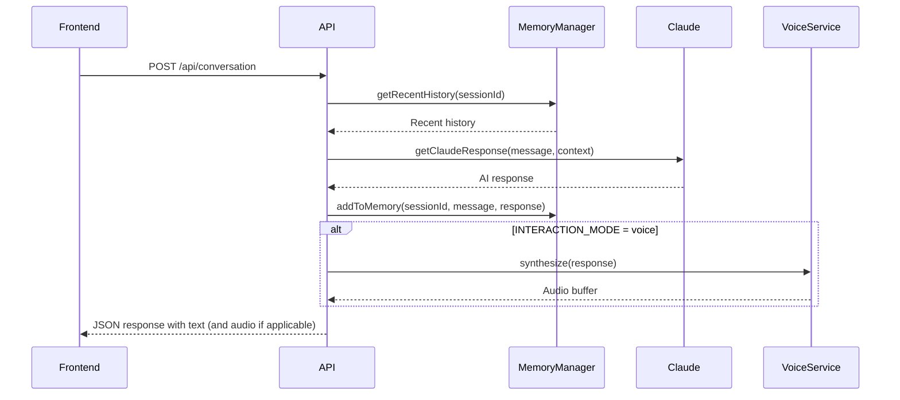
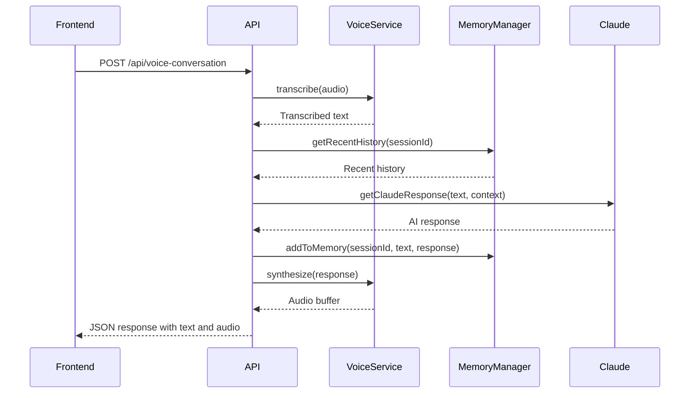

# Ambi API Documentation

This document provides comprehensive documentation for the Ambi API, which enables communication between the web frontend application and the backend services.

## API Overview

The Ambi API is a RESTful API built with Express.js that provides endpoints for:

1. **Conversation**: Text-based interaction with the AI
2. **Voice Conversation**: Voice-based interaction with the AI
3. **Emotion Analysis**: Detection and tracking of user emotions
4. **Proactive Engagement**: Management of AI-initiated conversations
5. **Health Check**: System status verification

All API endpoints are prefixed with `/api` except for the health check endpoint.

## Base URL

- **Development**: `http://localhost:4000`
- **Production**: `https://ambi-api.fly.dev`

## Authentication

Authentication is not implemented in the current POC version but will be added in future releases.

## API Endpoints

### Health Check

```
GET /health
```

Checks if the API server is running.

#### Response

```json
{
  "status": "ok"
}
```

### Text Conversation

```
POST /api/conversation
```

Sends a text message to the AI and receives a text response.

#### Request Body

```json
{
  "message": "Hello, how are you today?",
  "userId": "user123",
  "sessionId": "session456",
  "emotionData": {
    "emotion": "neutral",
    "confidence": 0.85
  }
}
```

| Field | Type | Required | Description |
|-------|------|----------|-------------|
| `message` | string | Yes | The user's message to the AI |
| `userId` | string | No | Unique identifier for the user |
| `sessionId` | string | No | Unique identifier for the conversation session |
| `emotionData` | object | No | Emotion data detected from the user's input |

#### Response

```json
{
  "reply": "I'm doing well, thank you for asking! How are you feeling today?",
  "sessionId": "session456",
  "audioReply": "base64EncodedAudioData"
}
```

| Field | Type | Description |
|-------|------|-------------|
| `reply` | string | The AI's text response |
| `sessionId` | string | Unique identifier for the conversation session |
| `audioReply` | string | Base64-encoded audio of the AI's response |

### Voice Conversation

```
POST /api/voice-conversation
```

Sends an audio message to the AI and receives both text and audio responses.

#### Request

- **Content-Type**: `application/octet-stream`
- **Body**: Raw audio data (binary)
- **Query Parameters**:
  - `userId` (optional): Unique identifier for the user
  - `sessionId` (optional): Unique identifier for the conversation session

#### Response

```json
{
  "audioReply": "base64EncodedAudioData",
  "textReply": "I'm doing well, thank you for asking! How are you feeling today?",
  "sessionId": "session456",
  "detectedEmotion": {
    "emotion": "happy",
    "confidence": 0.78
  }
}
```

| Field | Type | Description |
|-------|------|-------------|
| `audioReply` | string | Base64-encoded audio of the AI's response |
| `textReply` | string | The AI's text response |
| `sessionId` | string | Unique identifier for the conversation session |
| `detectedEmotion` | object | Emotion detected from the user's voice |

#### Implementation

```typescript
// From backend/src/index.ts
app.post('/api/voice-conversation', async (req: Request, res: Response): Promise<void> => {
  const interactionMode = process.env.INTERACTION_MODE === 'text' ? 'text' : 'voice'; 

  try {
    if (interactionMode !== 'voice') {
      res.status(400).json({ error: `Voice input not processed in '${interactionMode}' mode.` });
      return;
    }

    const audio = req.body;
    const userId = req.query.userId as string | undefined;
    const sessionId = req.query.sessionId as string | undefined;

    const currentSessionId = sessionId || `session_${Date.now()}_${Math.random().toString(36).substring(7)}`;

    try {
      const transcribedText = await voiceService.speechToText.transcribe(audio);

      if (!transcribedText) {
        res.status(400).json({ error: 'Failed to transcribe audio' });
        return;
      }

      await getRecentHistory(currentSessionId);

      const ambiReply = await getClaudeResponse(transcribedText, currentSessionId);

      await addToMemory(currentSessionId, transcribedText, ambiReply);

      const audioReply = await voiceService.textToSpeech.synthesize(ambiReply);

      if (!audioReply) {
        res.status(500).json({ error: 'Failed to synthesize speech' });
        return;
      }

      res.setHeader('Content-Type', 'application/json');

      const response = {
        audioReply: audioReply.toString('base64'),
        textReply: ambiReply,
        sessionId: currentSessionId
      };

      res.json(response);
      return;
    } catch (error) {
      res.status(500).json({ error: 'Internal server error processing voice conversation' });
      return;
    }
  } catch (error) {
    res.status(500).json({ error: 'Internal server error handling voice conversation request' });
    return;
  }
});
```

## Error Handling

The API uses standard HTTP status codes to indicate the success or failure of requests:

| Status Code | Description |
|-------------|-------------|
| 200 | Success |
| 400 | Bad Request - The request was invalid or cannot be served |
| 500 | Internal Server Error - Something went wrong on the server |

Error responses include a JSON object with an `error` field containing a description of the error:

```json
{
  "error": "Failed to transcribe audio"
}
```

## Data Flow

### Text Conversation Flow



### Voice Conversation Flow



## API Client Usage

### JavaScript/TypeScript Example

```typescript
// Example of using the Ambi API in a frontend application

// Text conversation
async function sendTextMessage(message, userId, sessionId) {
  try {
    const response = await fetch('http://localhost:4000/api/conversation', {
      method: 'POST',
      headers: {
        'Content-Type': 'application/json',
      },
      body: JSON.stringify({
        message,
        userId,
        sessionId,
      }),
    });
    
    const data = await response.json();
    
    // Handle text response
    console.log('AI Reply:', data.reply);
    
    // Handle audio response if available
    if (data.audioReply) {
      const audio = new Audio(`data:audio/mp3;base64,${data.audioReply}`);
      audio.play();
    }
    
    return data;
  } catch (error) {
    console.error('Error sending message:', error);
    throw error;
  }
}

// Voice conversation
async function sendVoiceMessage(audioBlob, userId, sessionId) {
  try {
    const url = new URL('http://localhost:4000/api/voice-conversation');
    
    if (userId) url.searchParams.append('userId', userId);
    if (sessionId) url.searchParams.append('sessionId', sessionId);
    
    const response = await fetch(url.toString(), {
      method: 'POST',
      headers: {
        'Content-Type': 'application/octet-stream',
      },
      body: audioBlob,
    });
    
    const data = await response.json();
    
    // Handle text response
    console.log('AI Reply:', data.textReply);
    
    // Handle audio response
    const audio = new Audio(`data:audio/mp3;base64,${data.audioReply}`);
    audio.play();
    
    return data;
  } catch (error) {
    console.error('Error sending voice message:', error);
    throw error;
  }
}
```

## Rate Limiting

Rate limiting is not implemented in the current version but will be added in future releases.

## Versioning

API versioning is not implemented in the current version but will be added in future releases.

## Next Steps

- [Tutorials](../tutorials/README.md): Step-by-step guides for using the API
- [Memory System](../memory-system/README.md): Documentation of the memory system
- [System Architecture](../system-architecture/README.md): Overview of the system architecture
