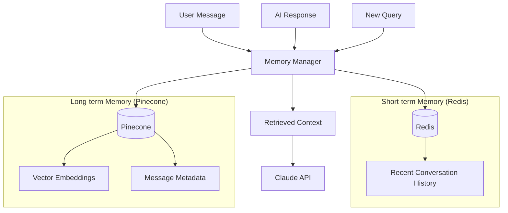
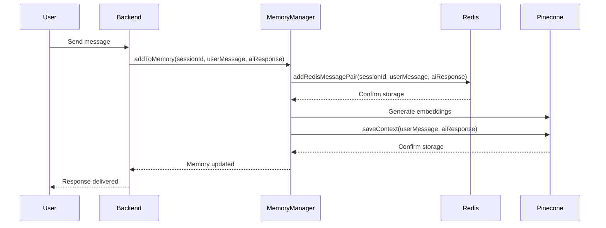
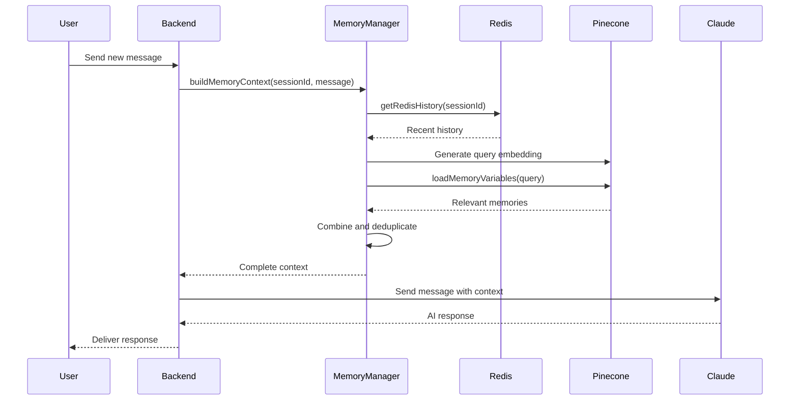

# Ambi Memory System

This document provides a comprehensive overview of the memory system used in Ambi, which is a core feature of the conversational companion.

## Memory System Architecture

Ambi implements a sophisticated two-tier memory system:

1. **Short-term Memory**: Implemented using Redis for fast access to recent conversations
2. **Long-term Memory**: Implemented using Pinecone for semantic search and retrieval of past conversations

This architecture allows Ambi to maintain context across conversations and recall relevant information when needed, creating a more natural and personalized experience.



## Memory Manager

The Memory Manager is the central component that coordinates both short-term and long-term memory systems. It provides a unified interface for storing and retrieving conversation history.

### Key Functions

```typescript
// From backend/src/services/memoryManager.ts

/**
 * Adds a message pair to both short-term and long-term memory.
 */
export const addToMemory = async (
  sessionId: string,
  humanMessageContent: string,
  aiMessageContent: string
): Promise<void> => {
  // Implementation details
};

/**
 * Retrieves the recent conversation history from short-term memory.
 */
export const getRecentHistory = async (
  sessionId: string
): Promise<BaseMessage[]> => {
  // Implementation details
};

/**
 * Retrieves relevant memories from long-term memory based on the current query.
 */
export const getRelevantMemories = async (
  sessionId: string,
  query: string
): Promise<BaseMessage[]> => {
  // Implementation details
};

/**
 * Builds a complete context for the AI by combining recent history and relevant memories.
 */
export const buildMemoryContext = async (
  sessionId: string,
  currentQuery: string
): Promise<BaseMessage[]> => {
  // Implementation details
};

/**
 * Clears all memory for a specific session.
 */
export const clearMemory = async (
  sessionId: string
): Promise<void> => {
  // Implementation details
};
```

## Short-term Memory (Redis)

The short-term memory system uses Redis to store recent conversation history for quick access.

### Implementation

```typescript
// From backend/src/services/redisMemoryService.ts

/**
 * Adds a message pair to the Redis-based short-term memory.
 */
export const addRedisMessagePair = async (
  sessionId: string,
  humanMessageContent: string,
  aiMessageContent: string
): Promise<void> => {
  // Implementation details
};

/**
 * Retrieves conversation history from Redis-based short-term memory.
 */
export const getRedisHistory = async (
  sessionId: string
): Promise<BaseMessage[]> => {
  // Implementation details
};

/**
 * Clears conversation history from Redis-based short-term memory.
 */
export const clearRedisHistory = async (
  sessionId: string
): Promise<void> => {
  // Implementation details
};
```

### Data Structure

In Redis, conversation history is stored as follows:

- **Key**: `session:{sessionId}:history`
- **Value**: JSON array of message objects, each containing:
  - `role`: Either "human" or "ai"
  - `content`: The message content
  - `timestamp`: When the message was created

The short-term memory has a configurable maximum length (`MAX_HISTORY_LENGTH`) to prevent excessive memory usage. When this limit is reached, the oldest messages are removed.

## Long-term Memory (Pinecone)

The long-term memory system uses Pinecone, a vector database, to store and retrieve conversation history based on semantic similarity.

### Implementation

```typescript
// From backend/src/services/pineconeMemoryService.ts

/**
 * Custom implementation of a vector store memory that uses Pinecone for storage.
 */
export class PineconeVectorMemory extends BaseMemory {
  /**
   * Loads memory variables based on the input values.
   */
  async loadMemoryVariables(values: InputValues): Promise<MemoryVariables> {
    // Implementation details
  }
  
  /**
   * Saves the context based on the input and output values.
   */
  async saveContext(inputValues: InputValues, outputValues: OutputValues): Promise<void> {
    // Implementation details
  }
  
  /**
   * Clears all memories from the vector store.
   */
  async clear(): Promise<void> {
    // Implementation details
  }
}

/**
 * Creates a Pinecone-backed vector memory for semantic search and retrieval.
 */
export const createPineconeMemory = (sessionId?: string): PineconeVectorMemory => {
  // Implementation details
};
```

### Vector Embeddings

Messages are converted to vector embeddings using OpenAI's Ada embeddings:

```typescript
// From backend/src/services/embeddingService.ts

/**
 * Generates an embedding vector for the given text.
 */
export const generateEmbedding = async (text: string): Promise<number[]> => {
  // Implementation details
};
```

### Message Categorization

Messages are categorized to improve retrieval relevance:

```typescript
// From backend/src/services/pineconeMemoryService.ts

/**
 * Simple categorization function for messages.
 */
const categorizeMessage = (content: string): string => {
  // Implementation details
};

/**
 * Determines the priority level of a message based on its content.
 */
const getPriorityLevel = (content: string): number => {
  // Implementation details
};
```

Categories include:
- Personal information
- Preferences
- Family
- Health
- Events
- General

Priority levels include:
- High (1): Important personal information
- Medium (2): Preferences and scheduled events
- Low (3): General conversation

## Memory Retrieval Process

When a new message is received, the memory system retrieves relevant context through the following process:

1. **Recent History Retrieval**:
   - Fetch the most recent messages from Redis
   - Limit to the configured maximum history length

2. **Semantic Search**:
   - Generate an embedding for the current query
   - Search Pinecone for semantically similar messages
   - Filter results based on relevance threshold

3. **Context Building**:
   - Combine recent history and relevant memories
   - Remove duplicates
   - Limit to the maximum context size
   - Organize messages in chronological order

4. **Context Integration**:
   - Provide the combined context to the Claude API
   - Include metadata about the source of each memory (short-term or long-term)

## Configuration

The memory system is configurable through environment variables:

- `MAX_HISTORY_LENGTH`: Maximum number of messages in short-term memory
- `MEMORY_TTL`: Time-to-live for memory entries in Redis
- `RELEVANCE_THRESHOLD`: Minimum similarity score for relevant memories
- `MAX_RESULTS`: Maximum number of results to retrieve from long-term memory

See the [Environment Variables](../database/environment-variables.md) documentation for details.

## Memory System Workflow

### Storing a New Conversation



### Retrieving Context for a New Message



## Best Practices

### Memory System Usage

1. **Always Include Session ID**: Ensure each conversation has a unique session ID to properly organize memory.
2. **Balance Context Size**: Include enough context for coherence but not so much that it exceeds token limits.
3. **Prioritize Recent History**: Recent messages are generally more relevant than older ones.
4. **Use Semantic Search Wisely**: Adjust relevance threshold based on the desired balance of recall vs. precision.

### Memory System Maintenance

1. **Regular Cleanup**: Implement TTL for Redis entries to prevent memory bloat.
2. **Index Optimization**: Periodically optimize Pinecone indexes for performance.
3. **Monitoring**: Track memory usage and retrieval performance metrics.
4. **Backup**: Regularly backup vector embeddings and metadata.

## Next Steps

- [API Documentation](../api/README.md): Reference for the backend API endpoints
- [Database Design](../database/README.md): Detailed documentation of the database structure
- [Memory System Tutorials](../tutorials/memory-system.md): Step-by-step guide to working with the memory system
