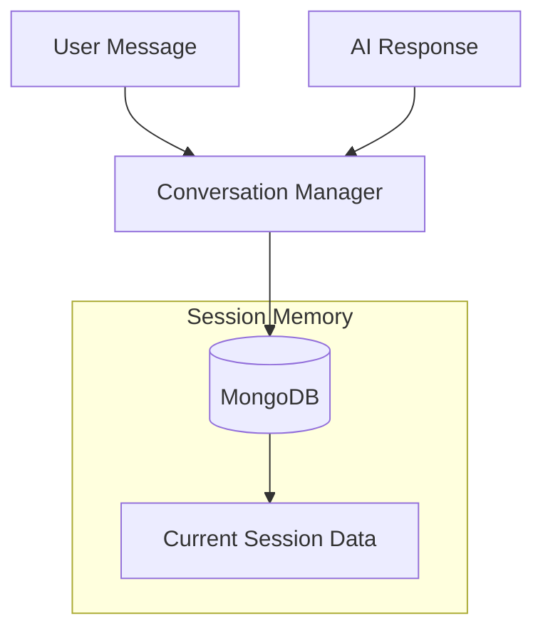

# Ambi Memory System

This document provides an overview of the memory system used in the Ambi web-based proof of concept (POC), which enables the AI to remember and recall information from conversations.

## Memory System Overview

Ambi implements a simplified conversation memory system using MongoDB for the web-based POC:

1. **Session Memory**: Maintains context during ongoing conversations
2. **User Memory**: Stores important user information and preferences
3. **Emotional Memory**: Tracks emotional patterns and responses

This architecture allows Ambi to maintain context during conversations while building a personalized experience based on user preferences and emotional states.

## Memory Components

### Session Memory

Session memory stores the current conversation context, allowing Ambi to maintain coherence within a single conversation session.



### User Memory

User memory stores persistent information about the user, including:

- Personal preferences
- Important dates
- Conversation topics of interest
- Interaction patterns

This information is used to personalize conversations and provide relevant responses.

### Emotional Memory

Emotional memory tracks the user's emotional states over time, enabling Ambi to:

- Recognize emotional patterns
- Adapt responses based on emotional context
- Initiate appropriate proactive engagement
- Provide emotionally supportive conversations

## Implementation

The memory system is implemented using MongoDB collections:

### Data Structure

```javascript
// User collection
{
  _id: ObjectId,
  userId: String,
  preferences: {
    topics: [String],
    voiceSettings: Object,
    accessibilitySettings: Object
  },
  personalInfo: {
    importantDates: [Object],
    relationships: [Object]
  },
  createdAt: Date,
  updatedAt: Date
}

// Session collection
{
  _id: ObjectId,
  sessionId: String,
  userId: String,
  messages: [
    {
      role: String, // "user" or "ai"
      content: String,
      timestamp: Date,
      emotion: {
        type: String,
        confidence: Number
      }
    }
  ],
  startedAt: Date,
  lastActiveAt: Date
}

// EmotionalState collection
{
  _id: ObjectId,
  userId: String,
  sessionId: String,
  timestamp: Date,
  emotion: String,
  confidence: Number,
  trigger: String,
  response: String
}
```

### Key Functions

```typescript
/**
 * Adds a message pair to the conversation session.
 */
export const addToSessionMemory = async (
  sessionId: string,
  userMessage: string,
  aiResponse: string,
  emotionData?: EmotionData
): Promise<void> => {
  // Implementation details
};

/**
 * Retrieves the recent conversation history from the session.
 */
export const getSessionHistory = async (
  sessionId: string,
  limit: number = 10
): Promise<Message[]> => {
  // Implementation details
};

/**
 * Updates or creates user preferences in memory.
 */
export const updateUserMemory = async (
  userId: string,
  preferences: UserPreferences
): Promise<void> => {
  // Implementation details
};

/**
 * Records emotional state data for analysis.
 */
export const recordEmotionalState = async (
  userId: string,
  sessionId: string,
  emotionData: EmotionData
): Promise<void> => {
  // Implementation details
};
```

## Memory Retrieval Process

When a new message is received, the memory system retrieves relevant context through the following process:

1. **Session Context Retrieval**:
   - Fetch the current session's conversation history
   - Limit to the most recent messages for context

2. **User Preference Integration**:
   - Retrieve user preferences and personal information
   - Include relevant preferences in the conversation context

3. **Emotional Context Analysis**:
   - Analyze recent emotional patterns
   - Provide emotional context to guide responses

4. **Context Building**:
   - Combine session history, user preferences, and emotional context
   - Format the context for the ElevenLabs Conversational AI

## Configuration

The memory system is configurable through environment variables:

- `SESSION_HISTORY_LIMIT`: Maximum number of messages to include in session context
- `EMOTION_TRACKING_ENABLED`: Enable or disable emotion tracking
- `EMOTION_CONFIDENCE_THRESHOLD`: Minimum confidence level for emotion detection

## Best Practices

### Memory System Usage

1. **Consistent Session IDs**: Ensure each conversation has a unique session ID to properly organize memory.
2. **Regular User Updates**: Update user preferences based on explicit statements and implied preferences.
3. **Emotion Validation**: Verify detected emotions with user feedback when confidence is low.
4. **Privacy Considerations**: Only store necessary information with clear user consent.

### Memory System Maintenance

1. **Regular Cleanup**: Implement TTL for old sessions to prevent database bloat.
2. **Performance Monitoring**: Track query performance and optimize as needed.
3. **Backup Strategy**: Regularly backup user data and preferences.

## Next Steps

- [API Documentation](../api/README.md): Reference for the backend API endpoints
- [Database Design](../database/README.md): Detailed documentation of the database structure
- [User Guide](../tutorials/user-guide.md): Guide to using Ambi's memory features
