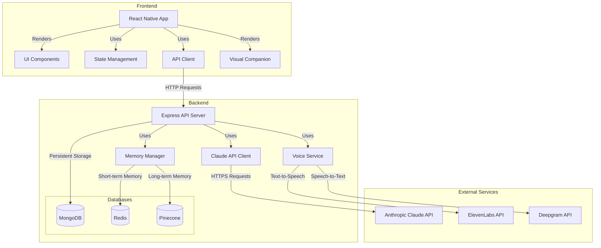

# Ambi System Architecture

This document provides a comprehensive overview of the Ambi system architecture, explaining how the various components interact to create a seamless conversational experience.

## High-Level Architecture

Ambi follows a client-server architecture with several integrated services:

## Core Components

### Frontend Components

1. **React Native App**: The main tablet application that provides the user interface.
   - Handles user interactions and displays AI responses
   - Manages application state and navigation
   - Renders the visual companion

2. **UI Components**: Built with React Native Paper for accessibility.
   - High-contrast, elder-friendly interface
   - Responsive design for various tablet sizes
   - Accessibility features for hearing, vision, and motor limitations

3. **State Management**: Uses Redux Toolkit to manage application state.
   - Stores conversation history
   - Manages UI state (listening, thinking, speaking)
   - Handles asynchronous operations

4. **API Client**: Communicates with the backend server.
   - Sends user messages to the API
   - Receives AI responses
   - Handles audio streaming for voice interactions

5. **Visual Companion**: Three.js-based visualization.
   - Provides visual feedback during conversations
   - Displays memory timelines and family photos
   - Creates an engaging, ambient presence

### Backend Components

1. **Express API Server**: The main entry point for the backend.
   - Handles HTTP requests from the frontend
   - Routes requests to appropriate services
   - Manages session state

2. **Memory Manager**: Coordinates the two-tier memory system.
   - Manages short-term memory in Redis
   - Handles long-term memory in Pinecone
   - Retrieves relevant context for conversations

3. **Claude API Client**: Interfaces with Anthropic's Claude API.
   - Sends user messages with context to Claude
   - Processes AI responses
   - Handles prompt engineering and context management

4. **Voice Service**: Manages speech processing.
   - Converts speech to text using Deepgram
   - Synthesizes speech from text using ElevenLabs
   - Optimizes voice for elderly users

### Database Components

1. **MongoDB**: Primary database for persistent storage.
   - Stores user profiles and preferences
   - Manages session information
   - Logs conversation metadata

2. **Redis**: In-memory database for short-term memory.
   - Stores recent conversation history
   - Caches frequently accessed data
   - Manages session state

3. **Pinecone**: Vector database for long-term memory.
   - Stores conversation embeddings for semantic search
   - Enables retrieval of relevant past conversations
   - Supports memory categorization and prioritization

### External Services

1. **Anthropic Claude API**: Large language model for conversation.
   - Generates natural, empathetic responses
   - Handles complex conversation context
   - Provides consistent personality and tone

2. **ElevenLabs API**: Text-to-speech service.
   - Converts AI responses to natural speech
   - Provides emotionally appropriate voice synthesis
   - Optimized for elderly hearing

3. **Deepgram API**: Speech-to-text service.
   - Converts user speech to text
   - Handles aging voice patterns and accents
   - Optimized for elder speech recognition

## Data Flow

### Conversation Flow

1. User speaks or types a message
2. Frontend sends the message to the backend API
3. Backend processes the message:
   - Transcribes speech to text (if voice input)
   - Retrieves relevant memory context
   - Sends message with context to Claude API
   - Receives AI response
   - Stores conversation in memory system
   - Synthesizes speech (if voice output)
4. Backend sends response to frontend
5. Frontend displays and/or speaks the response

### Memory Flow

1. New conversation pair (user message + AI response) is created
2. Memory Manager adds the pair to short-term memory (Redis)
3. Memory Manager creates embeddings for the messages
4. Embeddings are stored in long-term memory (Pinecone)
5. When a new message arrives, relevant memories are retrieved:
   - Recent history from short-term memory
   - Semantically similar conversations from long-term memory
6. Retrieved memories are combined to create context for the AI

## Configuration

The system is highly configurable through environment variables:

- `INTERACTION_MODE`: Controls whether the system uses voice or text interaction
- `MONGODB_URI`: Connection string for MongoDB
- `REDIS_URL`: Connection string for Redis
- `PINECONE_API_KEY` and `PINECONE_INDEX_NAME`: Credentials for Pinecone
- `ANTHROPIC_API_KEY`: API key for Claude
- `ELEVENLABS_API_KEY`: API key for ElevenLabs
- `DEEPGRAM_API_KEY`: API key for Deepgram

See the [Environment Variables](../database/environment-variables.md) documentation for a complete list.

## Next Steps

- [Database Design](../database/README.md): Detailed documentation of the database structure
- [Memory System](../memory-system/README.md): In-depth explanation of the memory implementation
- [API Documentation](../api/README.md): Reference for the backend API endpoints
