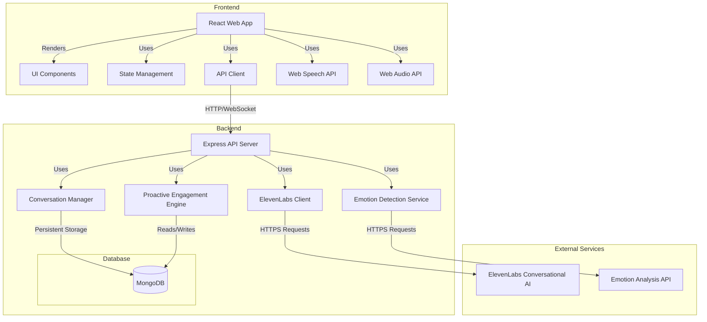

# Ambi System Architecture

This document provides an overview of the Ambi web-based proof of concept (POC) system architecture, explaining how the various components interact to create a seamless conversational experience.

## High-Level Architecture

Ambi follows a web-based client-server architecture with integrated services:

## Core Components

### Frontend Components

1. **React Web App**: The main web application that provides the user interface.
   - Handles user interactions and displays AI responses
   - Manages application state and navigation
   - Provides responsive design for various devices

2. **UI Components**: Built with React and Tailwind CSS for accessibility.
   - High-contrast, elder-friendly interface
   - Responsive design for desktop and tablet
   - Accessibility features for hearing, vision, and motor limitations

3. **State Management**: Uses React Context or Redux to manage application state.
   - Stores conversation history
   - Manages UI state (listening, thinking, speaking)
   - Handles asynchronous operations

4. **API Client**: Communicates with the backend server.
   - Sends user messages to the API
   - Receives AI responses
   - Handles WebSocket connections for real-time updates

5. **Web Speech API**: Handles browser-based speech recognition.
   - Converts user speech to text
   - Provides interim results for responsive feedback
   - Supports multiple languages

6. **Web Audio API**: Manages audio processing and playback.
   - Plays synthesized speech from ElevenLabs
   - Handles audio visualization
   - Manages audio input for speech recognition

### Backend Components

1. **Express API Server**: The main entry point for the backend.
   - Handles HTTP requests from the frontend
   - Manages WebSocket connections for real-time communication
   - Routes requests to appropriate services

2. **Conversation Manager**: Handles conversation flow and context.
   - Manages conversation sessions
   - Stores conversation history
   - Provides context for ongoing conversations

3. **ElevenLabs Client**: Interfaces with ElevenLabs Conversational AI.
   - Sends user messages to ElevenLabs
   - Processes AI responses
   - Handles voice synthesis requests

4. **Emotion Detection Service**: Analyzes user emotional state.
   - Processes voice and text for emotional cues
   - Categorizes emotions (happiness, sadness, etc.)
   - Provides emotional context for responses

5. **Proactive Engagement Engine**: Manages conversation initiation.
   - Determines appropriate times to initiate conversation
   - Selects topics based on user preferences and emotional state
   - Schedules and triggers proactive interactions

### Database Component

1. **MongoDB**: Primary database for persistent storage.
   - Stores user profiles and preferences
   - Manages conversation history
   - Logs emotional states and engagement metrics
   - Stores proactive engagement settings

### External Services

1. **ElevenLabs Conversational AI**: Core AI service for conversation.
   - Generates natural, empathetic responses
   - Provides voice synthesis capabilities
   - Handles conversation context

2. **Emotion Analysis API**: Service for emotion detection.
   - Analyzes voice patterns for emotional cues
   - Processes text for sentiment and emotion
   - Provides confidence scores for detected emotions

## Data Flow

### Conversation Flow

1. User speaks or types a message
2. Frontend sends the message to the backend API
3. Backend processes the message:
   - Transcribes speech to text (if voice input)
   - Retrieves relevant memory context
   - Sends message with context to Claude API
   - Receives AI response
   - Stores conversation in memory system
   - Synthesizes speech (if voice output)
4. Backend sends response to frontend
5. Frontend displays and/or speaks the response

### Memory Flow

1. New conversation pair (user message + AI response) is created
2. Memory Manager adds the pair to short-term memory (Redis)
3. Memory Manager creates embeddings for the messages
4. Embeddings are stored in long-term memory (Pinecone)
5. When a new message arrives, relevant memories are retrieved:
   - Recent history from short-term memory
   - Semantically similar conversations from long-term memory
6. Retrieved memories are combined to create context for the AI

## Configuration

The system is highly configurable through environment variables:

- `INTERACTION_MODE`: Controls whether the system uses voice or text interaction
- `MONGODB_URI`: Connection string for MongoDB
- `REDIS_URL`: Connection string for Redis
- `PINECONE_API_KEY` and `PINECONE_INDEX_NAME`: Credentials for Pinecone
- `ANTHROPIC_API_KEY`: API key for Claude
- `ELEVENLABS_API_KEY`: API key for ElevenLabs
- `DEEPGRAM_API_KEY`: API key for Deepgram

See the [Environment Variables](../database/environment-variables.md) documentation for a complete list.

## Next Steps

- [Database Design](../database/README.md): Detailed documentation of the database structure
- [Memory System](../memory-system/README.md): In-depth explanation of the memory implementation
- [API Documentation](../api/README.md): Reference for the backend API endpoints
